# HOOK TRACKER

A webhook gateway and retry engine. Your backend hands it one event; it takes
responsibility for getting that event delivered to every endpoint that wants it —
retrying on a TTL/DLX ladder when the receiver is down, signing every request, and
keeping a full audit trail of each attempt.

It ships as a self-contained repository: `docker compose up` brings up the whole
stack — Postgres, Redis, RabbitMQ, the API, the delivery workers, the maintenance
jobs, the dashboard, and a demo receiver you can point at to watch the retry ladder
work.

| Dark | Light |
|---|---|
| 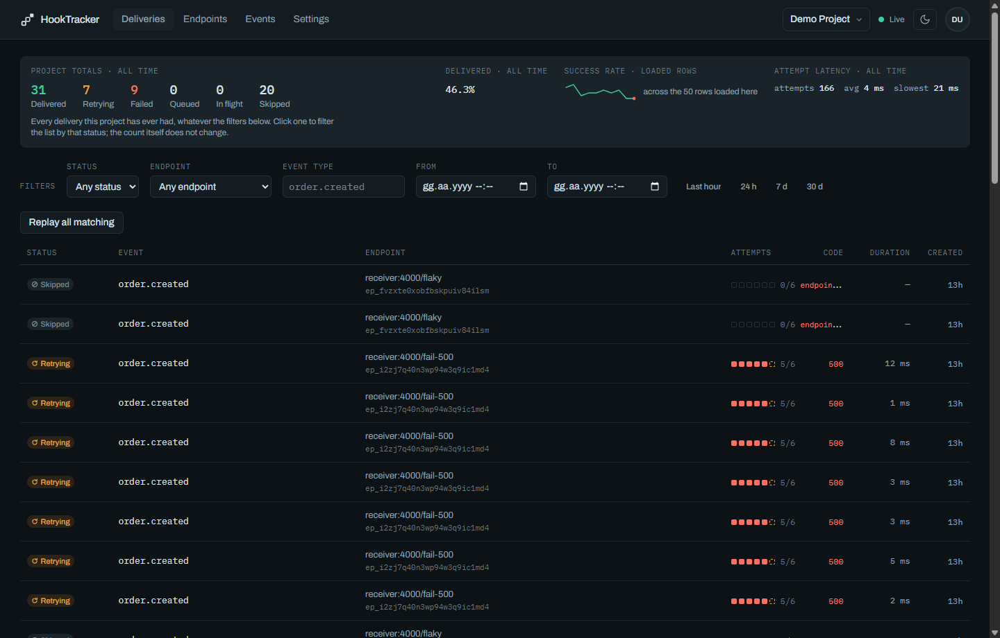 | 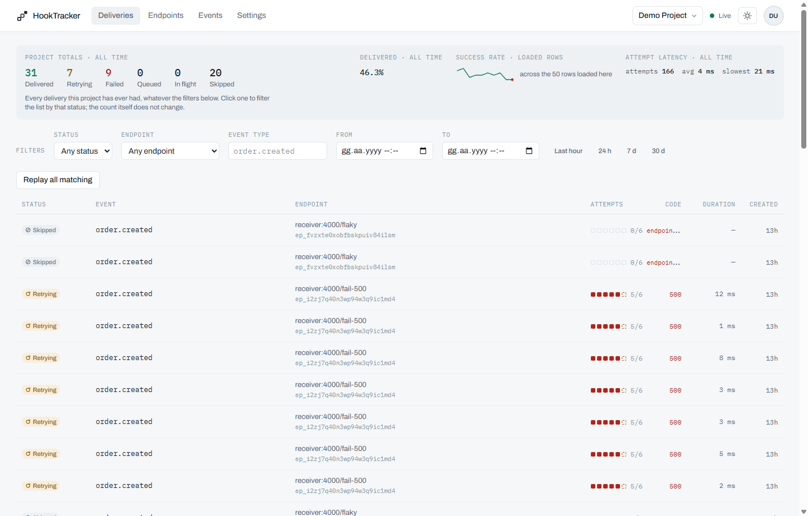 |

## Why it exists

Calling a partner's HTTP endpoint directly puts three problems in your request path:
their downtime becomes your lost notification, their slowness becomes your latency,
and their flakiness becomes retry code you have to write and get right. hook-tracker
takes all three out of your process.

- **Nothing is lost.** Every event is persisted before it is queued, and every
  attempt is recorded. A receiver that is down for six hours still gets its event.
- **Retries are the queue's job.** A TTL/DLX ladder in RabbitMQ — 1m, 5m, 30m, 2h,
  6h — with no scheduler process and no `setTimeout` loops.
- **Every request is signed.** HMAC-SHA256 over the timestamp and raw body, with a
  rotation window so receivers can change keys without downtime.
- **You can see what happened.** A per-attempt audit trail: response code, duration,
  captured body snippet, and the exact error when there was no response at all.
- **Outbound URLs are guarded.** Every delivery target passes an SSRF check —
  resolved, range-checked, and pinned — so a user-supplied URL cannot reach your
  internal network.

## 60-second quickstart

```bash
cp .env.example .env
docker compose up -d --build

# demo user, project, API key and an endpoint pointing at the bundled receiver
docker compose run --rm migrate npm run seed
```

Open **http://localhost:8080** and sign in with `demo@hook-tracker.dev` /
`demo-password-123`. Then publish an event:

```bash
curl -X POST http://localhost:3000/v1/publish \
  -H 'Content-Type: application/json' \
  -H 'Authorization: Bearer ht_...' \
  -d '{"eventType":"order.created","payload":{"orderId":1234}}'
```

The delivery appears in the dashboard immediately and updates in place as it is
attempted — no refresh. Create your own account at `/register` instead of seeding if
you would rather start empty; the first thing you register becomes a project you own.

The `.env.example` placeholders for `JWT_SECRET` and `SECRET_ENCRYPTION_KEY` work for
local development and are **refused** when `NODE_ENV=production`. Generate real ones
with `openssl rand -hex 32`. `SECRET_ENCRYPTION_KEY` cannot be rotated without
re-encrypting every stored endpoint secret; that migration is out of scope for v1.

## How it fits together

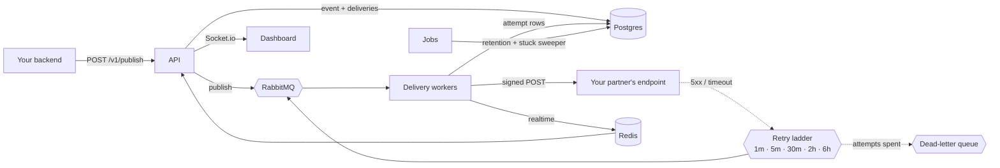

A delivery is one event aimed at one endpoint. One event fanned out to three
endpoints produces three deliveries, each with its own status and its own ladder
position. Attempts belong to a delivery: at most six, and every one of them is a row.

| Dark | Light |
|---|---|
| 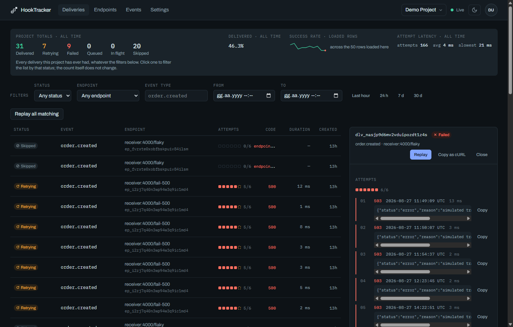 | 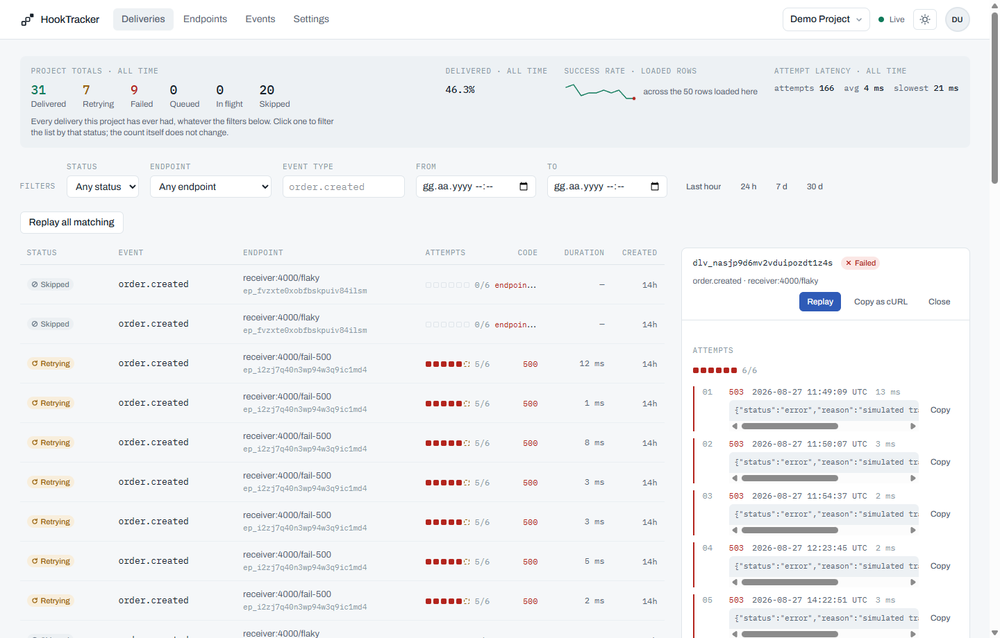 |

## The dashboard

Every screen reads the same API a script would call. The theme follows the system
preference until the header toggle overrides it, cycling system, light and dark — every
screen below is shown in both.

Endpoints are the HTTP targets of a project, each with its own signing secret, rate
limit and consecutive-failure count. A disabled endpoint says why it is disabled and
offers the one action that resumes delivery.

| Dark | Light |
|---|---|
| 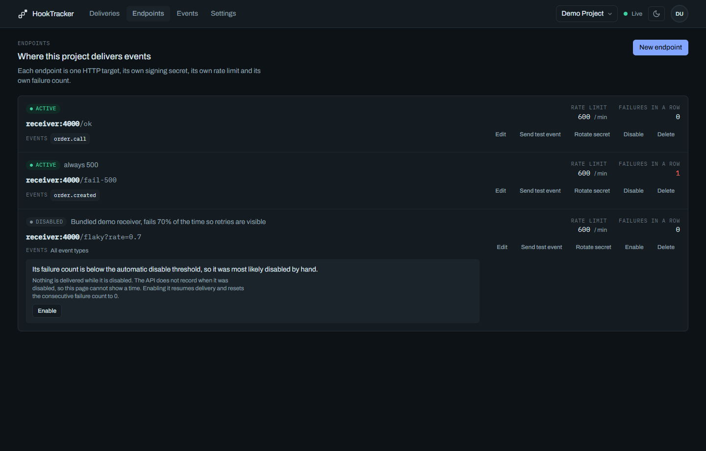 | 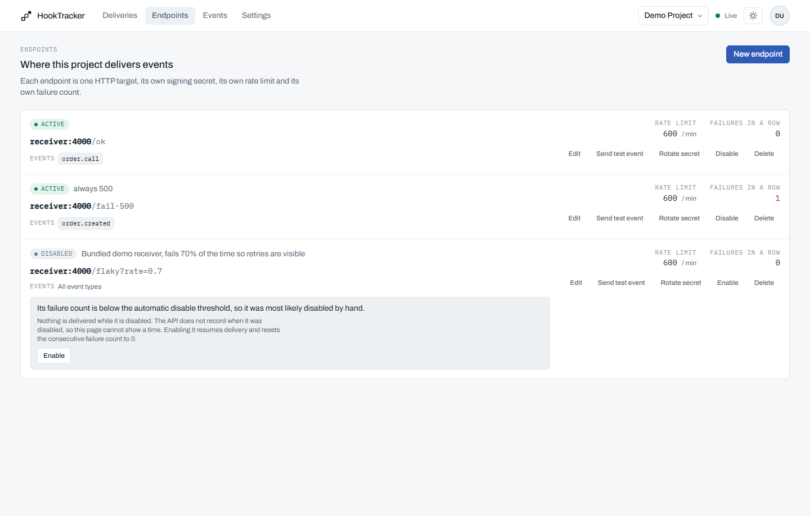 |

The events screen groups deliveries by the event that produced them, so a fan-out that
ended differently on different endpoints is one row to read rather than three.

| Dark | Light |
|---|---|
| 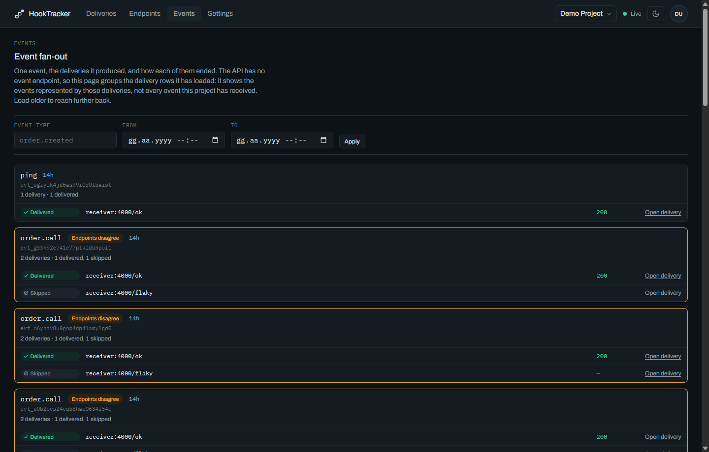 | 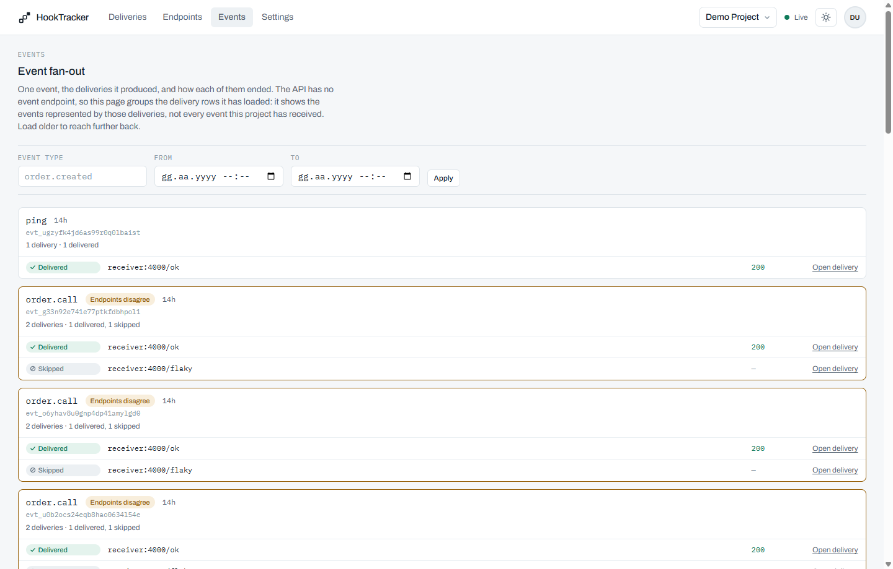 |

Settings holds the project name, its members and their roles, and the API keys — listed
by prefix and last use, because a key's full value is shown exactly once, when it is
created.

| Dark | Light |
|---|---|
| 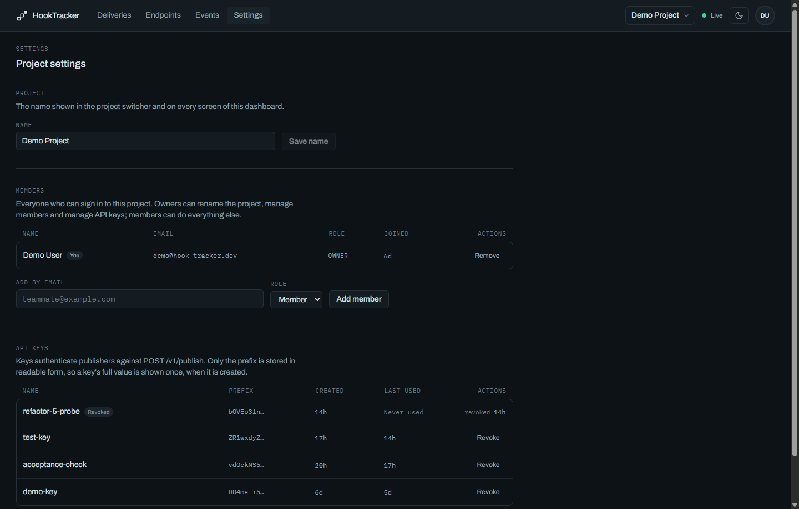 | 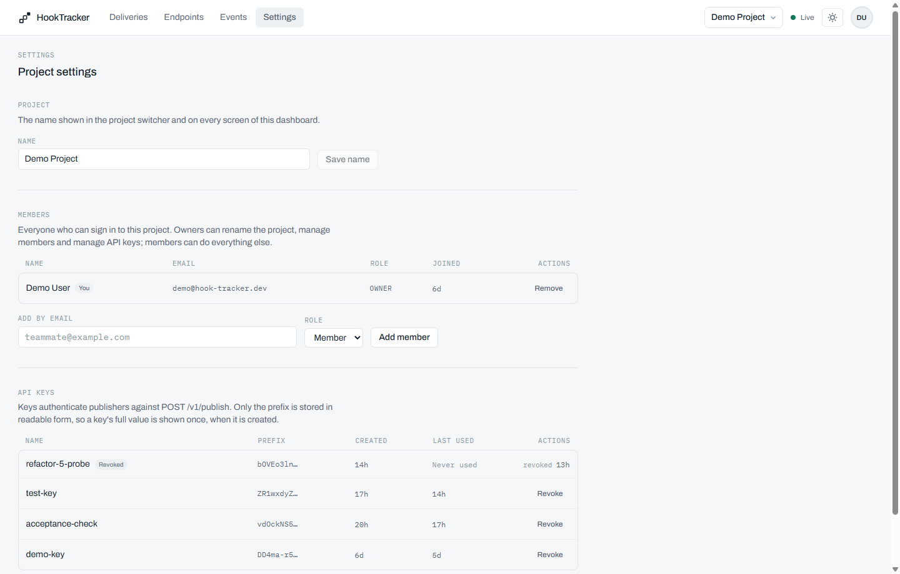 |

## Operating it

| Endpoint | What it answers |
|---|---|
| `GET /health` | Liveness, no dependency checks |
| `GET /ready` | Postgres, Redis and RabbitMQ reachability — `503` when any is down |
| `GET /docs` | Browsable API reference, generated from the same zod schemas the routes validate with |
| `GET /openapi.json` | The OpenAPI 3.1 document behind `/docs` |
| `GET /metrics` | Prometheus exposition — `hooktracker_*` series, deliberately low-cardinality |

`/metrics` carries no project id, endpoint id or URL in any label: Prometheus creates
one series per label combination, so a per-tenant label grows without bound. Per-project
figures come from `GET /v1/projects/:projectId/stats` instead, which is what the
dashboard uses.

The `jobs` process runs two schedules: retention deletes events past `RETENTION_DAYS`
in bounded batches, and the stuck sweeper returns deliveries left `IN_FLIGHT` past
`STUCK_DELIVERY_MINUTES` to `RETRYING` and re-publishes them — covering a worker killed
between the HTTP call completing and the transaction committing.

## Receiving webhooks

If you are on the other end — the team whose endpoint hook-tracker calls — read
[`docs/receiving-webhooks.md`](docs/receiving-webhooks.md). It covers signature
verification, timestamp tolerance, deduplicating on `X-Webhook-Id`, which status code
to answer with, and working Node.js and Python receivers you can copy.

## Layout

| Path | What it is |
|---|---|
| `backend/` | Node 24 + Express. One image, four entrypoints: `api`, `worker`, `jobs`, `demo-receiver`, sharing `src/shared`. |
| `dashboard/` | Vue 3 + Vite + Tailwind, served by nginx, proxying `/v1` and `/socket.io` to the API. |
| `docs/` | The specification. Read it before changing behavior. |

`backend/` and `dashboard/` are independent packages with their own `node_modules`.
There is no root workspace — never run `npm install` at the repository root.

| Service | Port | Notes |
|---|---|---|
| dashboard | 8080 | the operator UI |
| api | 3000 | Express + Socket.io |
| worker | – | scales through `deploy.replicas` |
| jobs | – | retention and the stuck-delivery sweeper |
| receiver | – | demo target; reachable only inside the Docker network |

Only the dashboard and the API publish ports to the host.

## Documentation

| Document | Contents |
|---|---|
| [`docs/architecture.md`](docs/architecture.md) | Data flow, queue topology, retry ladder, SSRF guard, data model, configuration reference |
| [`docs/api.md`](docs/api.md) | The v1 HTTP contract |
| [`docs/dashboard.md`](docs/dashboard.md) | Operator UI specification |
| [`docs/guidelines.md`](docs/guidelines.md) | Coding, security and testing rules |
| [`docs/code-review.md`](docs/code-review.md) | The rules every change is reviewed against |
| [`docs/implementation-plan.md`](docs/implementation-plan.md) | Phase order and completion state |
| [`docs/receiving-webhooks.md`](docs/receiving-webhooks.md) | For teams on the receiving end |

## Local development

Node 24 is the pinned runtime (`.nvmrc`, `engines`, and the Docker base image all agree).

```bash
cd backend && npm install
cd ../dashboard && npm install
```

Both packages expose `npm run lint` and `npm run format`. The backend adds
`npm test` (unit), `npm run test:integration` (Testcontainers, real Postgres,
Redis and RabbitMQ) and `npm run test:docker`, a one-test probe that tells a
Docker problem apart from a code one.

The dashboard's dev server proxies `/v1` and `/socket.io` to the API, so the refresh
cookie stays same-origin:

```bash
cd dashboard && npm run dev
```

See [`CONTRIBUTING.md`](CONTRIBUTING.md) for the full workflow and
[`SECURITY.md`](SECURITY.md) for reporting a vulnerability.

## License

MIT — see [`LICENSE`](LICENSE).
